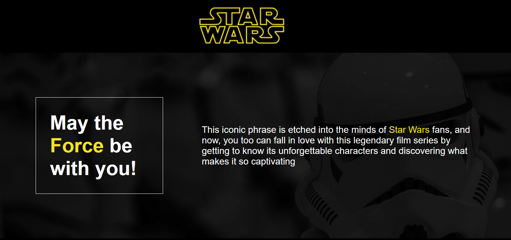

# Ajax Redux - Star Wars API

**Objective:** This project's objective is to be able to succesfully populate a website using data from the Star Wars API (https://swapi.dev/). With the use of the Fetch API and AJAX requests, the names of characters, along with movies they are in and their respective opening crawls were added.

## Installation
No installation required

## Usage
Just enjoy!

## Contributing
1. Fork it!
2. Create your feature branch: `git checkout -b my-new-feature`
3. Commit your changes: `git commit -am 'Add some feature'`
4. Push to the branch: `git push origin my-new-feature`
5. Submit a pull request :D

## History
February 2024

## Credits
Jenifer Quelali Evangelista
Rodrigo Nascimento

## License
MIT